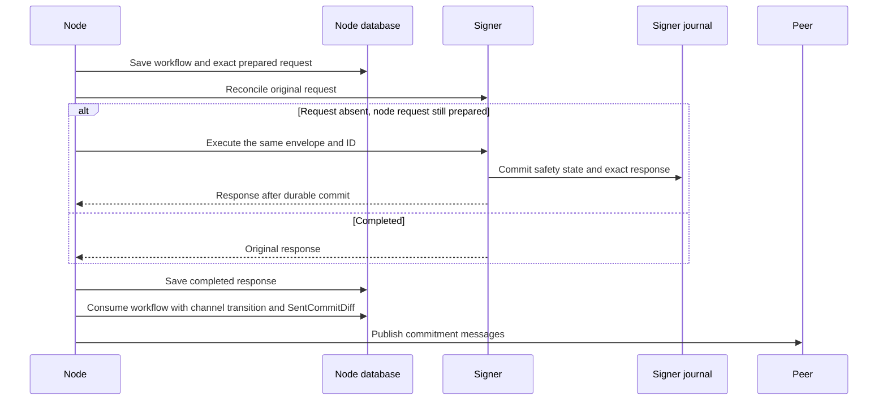

# Node recovery for the native remote signer

Branch: `wip/remotesigner`. The FAFO policy permits fresh state and identities;
prior-version migration is not required. Active channels still require safe recovery.
The current branch incorporates FAFO `dd598216` and PR #32.

## Implemented boundary

Normal channel commitment signing, taproot reconnect signing and revocation release
have durable node workflows. Opening/allocation, cooperative close, splicing,
force close and on-chain resolution do not yet have equivalent application workflows.
Signer receipts for an operation alone do not establish node-side recovery for it.

`SigningWorkflows` binds a transition to its channel, commitment counters, signing
inputs, signer identity, network and schema. `SigningRequests` stores each original
protobuf envelope, request ID, argument fingerprint and exact response. These bytes
are opaque in Domain and Application; transport details remain in RemoteSigning.
Deterministic public basepoint lookup remains a read inside a workflow and consumes
no recovery ordinal. Signing and secret-release operations remain captured.

Intent and result writes use separate short-lived units of work. They cannot flush
unrelated channel changes, and no database transaction spans an RPC. Consumption
uses the channel transition's unit of work, so its state and retransmission data
commit atomically. SQLite retains the production `synchronous=FULL` interceptor.
All three database providers have migrations and compiled models.

An incoming commitment saves its new local state and `ReleaseRevoke` intent together.
Only then may the signer advance, reveal the revoked commitment's secret and return
the next point/nonces. Revealed per-commitment secrets are intended Lightning
protocol outputs; persisting them does not export funding, wallet or root keys.

## Restart rules

Startup resumes pending work under the channel lock before startup repair, signer
registration or rollback of uncommitted updates. Reconnect follows the same order;
disconnect preserves inputs belonging to pending signing. Freshly loaded database
state must match the workflow's signing snapshot before requests can execute.

A prepared request is reconciled using its original envelope. `Completed` returns
the original result; `NotFound` permits execution of that same request. A locally
completed request additionally requires a signer `Completed` receipt whose response
matches byte for byte. It never executes again merely because the signer reports
`NotFound`. Unknown, invalidated, unsupported or mismatched results block recovery.
There is no native fallback, replacement request ID or operator rollback step.

Saved commitment diffs and original signer responses remain exact. Taproot
reestablishment can require a fresh partial signature for a new peer verification
nonce; that signing is a separate captured workflow for the same commitment.
Do not equate this with byte-identical taproot wire messages across handshakes.
Consumed revocation retransmission reconstructs deterministic outputs for unchanged
fundings; arbitrary splice changes do not have a retained exact revocation-wire proof.

## Proof and remaining gates

`NodeWorkflowCrashTests` uses separate node processes and real migrated SQLite
databases while the signer remains running. Its boundaries cover prepared intent,
signer completion before node response capture, persisted response, consumed
commitment before publication, incoming commitment before its database save,
saved revocation intent, consumed revocation before publication and prepared
taproot reconnect signing: eight process-kill boundaries. Independent
checks refuse secret release on either side of the local save until signer advance.
Restart uses the channel manager, reconnects both nodes and
checks subsequent payments and commitment/balance convergence. Negative cases
exercise stale snapshots/fundings, data loss, invalidated or missing signer receipts,
and changed saved responses. The missing-receipt case removes the completed
request's journal record from a stopped signer while retaining the node response
and every other journal record; recovery refuses before another execution and
leaves the remaining signer journal unchanged. These are in-process protocol peers,
not a new live
LND interoperability or on-chain recovery acceptance run.

The local coordinator serializes channel workflows; database uniqueness and state
concurrency reject conflicting records. This is not deployment-wide writer fencing
and does not protect cloned databases or external storage rollback. Retained receipts
are bounded and never evicted; maintenance and compaction remain NL-1306.

NL-1305 tracks broader application workflow coverage. NL-1307 tracks the fresh-node
VLS adapter. The independent [VLS gateway prototype](../../tools/vls-gateway/README.md)
adds durable policy-state/receipt experiments but is not wired into NLightning.
Nitro attestation, vsock deployment and external state freshness remain NL-1308.

The native C# service provides key isolation and its existing signing guards. It
still trusts node-supplied policy inputs; these recovery workflows do not turn it
into an independent validating signer.

## Merged-branch validation

FAFO `dd598216` is an ancestor of this branch. The local integration selection
(excluding Docker, cluster and SQL Server suites) passes 1,207 tests against the
combined schema; optional benchmark/scale cases
are not run. All 4,575 application tests and 1,780 daemon tests pass. Bitcoin
infrastructure tests pass 2,466 cases (three skips and two optional cases not run).
All 65 remote-signing tests pass, including eight node-process kill boundaries,
six negative restarts and three supplementary synthetic receipt-policy cases.
The explicit subprocess-worker entrypoint is not run as an independent test.
The solution configuration check passes for all 44 projects, and the complete
solution format gate passes with the configured Blazor-test exclusion.
The C# test counts above are for net10.0. The Release solution build passes for
both net10.0 and net11.0 with zero warnings and errors.
The VLS gateway process test passes with independent signatures, durable receipt
replay and policy refusal checks; see its README for the exact prototype limits.
