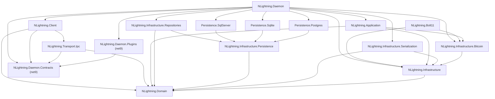

# NLightning Repository Map (for agents)

> Status: generated 2026-09-25 against `main` @ `e330fcf` (release v2.0.0 merge); refreshed 2026-09-25 on `wip/fafo` @ `1a38360` after the fix swarm (§1, §3-§5, §6.4, §8-§11). Bug status lives in [`ISSUES.md`](ISSUES.md), not here.
> Every path is repo-relative. Claims marked **(verified)** were spot-checked directly against the source when this map was written. Everything else comes from per-area research passes that cite file/line. If a claim matters for a change you are about to make, re-check the cited line first, because line numbers drift.

NLightning is a C# / .NET 10 Lightning Network node and library set. It uses a clean-architecture layering (Domain -> Application / Infrastructure.* -> Daemon / Client), though not strictly (see [Layering reality](#23-layering-reality)). Today the node can: speak BOLT 8, exchange BOLT 1 init/ping/error/warning, open single-funded (v1) channels end to end against LND (open_channel -> funding -> channel_ready), manage an on-chain wallet via bitcoind RPC+ZMQ, and encode/decode BOLT 11 invoices. It has a standalone BOLT 4 onion library (Sphinx construct/peel, hop payloads, replay cache; M1+M2) that nothing calls yet. It **cannot** yet move HTLCs, close channels, reestablish, gossip, or forward/fail onions.

---

## Contents

1. [Quick start for agents](#1-quick-start-for-agents)
2. [Solution layout and project dependency graph](#2-solution-layout-and-project-dependency-graph)
3. [Per-project maps](#3-per-project-maps)
4. [End-to-end flow walkthrough](#4-end-to-end-flow-walkthrough)
5. [BOLT coverage matrix](#5-bolt-coverage-matrix)
6. [Onion routing (BOLT 4) readiness](#6-onion-routing-bolt-4-readiness)
7. [How-to recipes](#7-how-to-recipes)
8. [Tests map](#8-tests-map)
9. [Build, CI, tooling](#9-build-ci-tooling)
10. [Consolidated TODO / gap / bug table](#10-consolidated-todo--gap--bug-table)
11. [Cross-cutting gotchas](#11-cross-cutting-gotchas)

---

## 1. Quick start for agents

| Task | Command (run from repo root) |
|---|---|
| Build (CI-equivalent) | `dotnet build --configuration Release -p:MSBuildWarningsAsMessages=MSB4121` |
| Build native-crypto variant | `dotnet build --configuration Release.Native -p:MSBuildWarningsAsMessages=MSB4121` |
| Format gate (hard CI gate) | `dotnet format --verify-no-changes --exclude "**/BlazorTests/**"` |
| Tests (CI-equivalent) | `dotnet test --no-build -c Release --filter 'FullyQualifiedName!~Docker'` |
| One VSTest test | `dotnet test test/<Proj>/<Proj>.csproj -c Release --no-build --filter "FullyQualifiedName~<Class>"` (keep `-c Release`: the build above is Release-only, and stale `bin/Debug` output would otherwise be tested silently) |
| Application / Daemon tests | Found by `dotnet test` like the others (NL-167). The xunit v3 exe also works: `dotnet run --project test/NLightning.Application.Tests -- -class <FQN>` (or `-method '*Name*'`) |
| Run node | `dotnet run --project src/NLightning.Daemon -- --network regtest` (first run writes `~/.nltg/regtest/appsettings.json`) |
| Run CLI | `dotnet run --project src/NLightning.Client -- --network regtest info` |

Baseline observed on macOS arm64 with SDK 10.0.103 (`wip/fafo` @ `1a38360`):
- Debug, Release and Release.Native build with 0 errors.
- 8 code warnings, all nullability `CS86xx` (NL-171), plus 2 MSB4121 solution-config warnings unless `-p:MSBuildWarningsAsMessages=MSB4121` is passed. NuGet advisories are fixed or pinned (NL-170).
- Format check passes.
- The CI-style test run gives **2146 tests: 2145 pass, 1 skipped** (the NL-056 HTLC second-stage vector), in both Release and Release.Native. It is hermetic (NL-168).
- Docker LND e2e: 10/10 pass locally (not in CI).
- `Release.Wasm` fails on macOS because `src/NLightning.Infrastructure/Crypto/Providers/JS/package.json` pins linux-x64 esbuild/rollup. It builds only on linux-x64, which is what CI uses.

**Traps to know before editing anything:**
- Crypto code is compiled three times (`CRYPTO_LIBSODIUM`, `CRYPTO_NATIVE`, `CRYPTO_JS`). Build `Release` **and** `Release.Native` after touching `src/NLightning.Infrastructure/Crypto`.
- `.editorconfig` sets many IDE and naming rules to `error`, but `EnforceCodeStyleInBuild` is off. So the build can be green while `dotnet format` fails. Run the format command before finishing.
- Namespace style: file-scoped namespace **first**, then `using Domain.X;` directives written relative to `NLightning` and placed **after** it. System/Microsoft usings go above. Private fields are `_camel`, private static fields `s_camel`.
- Test naming: `Given_X_When_Y_Then_Z` (xUnit v3 + Moq).

---

## 2. Solution layout and project dependency graph

`NLightning.sln` holds 27 C# projects and 6 solution configs: Debug, Release, Debug.Native, Release.Native, Debug.Wasm, Release.Wasm. `global.json` pins SDK 10.0.0 (rollForward latestMinor). `src/Directory.Build.props` sets net10.0, Nullable, ImplicitUsings, Deterministic and package metadata **for src/ only**. Test projects re-declare these settings.

### 2.1 src/ projects

| Project | TFM | Version | Role |
|---|---|---|---|
| `src/NLightning.Domain` | net10.0 | 2.0.0 | Pure model and ports. No NuGet dependencies and no project references **(verified)** |
| `src/NLightning.Infrastructure` | net10.0 | 2.0.0 | Crypto (3 backends), BOLT 8 transport, per-peer services, TLV converters, protocol services |
| `src/NLightning.Infrastructure.Bitcoin` | net10.0 | 1.0.0 | NBitcoin: tx builders, scripts, signer, key manager, ECDH, wallet, chain monitor, fee service |
| `src/NLightning.Infrastructure.Serialization` | net10.0 | — | Wire (de)serializers: messages, payloads, TLV, BigSize, value objects |
| `src/NLightning.Infrastructure.Persistence` | net10.0 | — | EF Core 10 model (`NLightningDbContext`), entities, configs, DI provider selection |
| `src/NLightning.Infrastructure.Persistence.{Postgres,Sqlite,SqlServer}` | net10.0 | — | Per-provider migrations assemblies |
| `src/NLightning.Infrastructure.Repositories` | net10.0 | — | `UnitOfWork`, DB repositories, in-memory channel and UTXO repositories |
| `src/NLightning.Application` | net10.0 | 1.0.0 | `PeerManager`, `ChannelManager`, BOLT 2 v1 open handlers, `MessageFactory` |
| `src/NLightning.Bolt11` | net10.0 | 5.0.0 | BOLT 11 invoice library (only test projects consume it) |
| `src/NLightning.Daemon` | net10.0 | 0.0.1 | Executable host and composition root, IPC server |
| `src/NLightning.Daemon.Contracts` | **net9.0** | — | Paths, CLI parsing helpers, `IControlClient` (unused) |
| `src/NLightning.Daemon.Plugins` | **net9.0** | — | Plugin API (`IDaemonPlugin`, `IDaemonContext`), not wired up |
| `src/NLightning.Transport.Ipc` | net10.0 | — | IPC envelope, DTOs, MessagePack formatters |
| `src/NLightning.Client` | net10.0 | — | CLI (`nltg` per the usage text; the assembly is `NLightning.Client`) |

### 2.2 Project reference graph (from csproj `ProjectReference`, verified)

### 2.3 Layering reality

- **Application references Infrastructure and Infrastructure.Bitcoin directly.** `IBlockchainMonitor`, `IBitcoinWalletService`, the tx builders, `ITcpService` and `PeerAddress` all come from Infrastructure namespaces. New Application code can use those, but prefer declaring new ports in Domain.
- `Transport.Ipc -> Daemon.Contracts` is declared but no source file uses it.
- Nothing in `src/` references `NLightning.Bolt11`.
- DI is spread across projects. `ITlvConverterFactory` (whose class lives in Infrastructure) is `TryAddSingleton`ed by both `AddInfrastructureServices` and `AddSerializationInfrastructureServices`. `IEcdh` is registered in `src/NLightning.Infrastructure.Bitcoin/DependencyInjection.cs:34`. Signer, key manager, fee service and the Domain factories are registered only in `src/NLightning.Daemon/Extensions/NodeServiceExtensions.cs`, and they are **mirrored by hand** in the Docker integration tests.

### 2.4 DI entry points (the composition root is `src/NLightning.Daemon/Extensions/NodeServiceExtensions.cs`)

| Extension method | File | Registers |
|---|---|---|
| `AddApplicationServices` | `src/NLightning.Application/DependencyInjection.cs` | Singletons: `IChannelManager`, `IMessageFactory`, `IPeerManager`. Every `IChannelMessageHandler<>` is registered Scoped via reflection, plus `FundingConfirmedMessageHandler` **(verified)** |
| `AddInfrastructureServices` | `src/NLightning.Infrastructure/DependencyInjection.cs` | Singletons: `IChannelIdFactory`, `IMessageServiceFactory`, `IPeerServiceFactory`, `ITcpService`, `ISha256`, `ITransportServiceFactory`. Transient: `IPingPongService` |
| `AddBitcoinInfrastructure` | `src/NLightning.Infrastructure.Bitcoin/DependencyInjection.cs` | Singletons: `IBitcoinChainService`, `IBlockchainMonitor`, `ICommitmentKeyDerivationService`, `ICommitmentTransactionBuilder`, `IEcdh`, `IFundingOutputBuilder`, `IFundingTransactionBuilder`, `IKeyDerivationService`. Scoped: `IBitcoinWalletService` |
| `AddSerializationInfrastructureServices` | `src/NLightning.Infrastructure.Serialization/DependencyInjection.cs` | Singletons: `IFeatureSetSerializer`, `IMessageSerializer`, `IMessageTypeSerializerFactory`, `IPayloadSerializerFactory`, `ITlvSerializer`, `ITlvStreamSerializer`, `IValueObjectSerializerFactory` (`DependencyInjection.cs:24-30`) |
| `AddPersistenceInfrastructureServices` | `src/NLightning.Infrastructure.Persistence/DependencyInjection.cs` | `NLightningDbContext` (provider selected from `Database:Provider`) |
| `AddRepositoriesInfrastructureServices` | `src/NLightning.Infrastructure.Repositories/DependencyInjection.cs` | `IUnitOfWork` (scoped), `IChannelMemoryRepository` and `IUtxoMemoryRepository` (singletons) |
| Daemon-only | `NodeServiceExtensions.cs` ~L96-141 | `ISecureKeyManager` instance, `FeeService` (HttpClient), `LocalLightningSigner`, `ChannelOpenValidator`, `ChannelFactory`, `CommitmentTransactionModelFactory`, `FundingTransactionModelFactory`, the IPC stack |

Not registered anywhere: `DustService`, `InteractiveTransactionService`, `PluginLoaderService`, `RevocationWatchDbRepository`. Individual `*DbRepository` classes are also not registered; reach them only through `IUnitOfWork`.

---

## 3. Per-project maps

### 3.1 NLightning.Domain (`src/NLightning.Domain`)

**Purpose:** a library-free domain model plus ports. It has no serialization logic and no NBitcoin. `AssemblyInfo.cs` grants InternalsVisibleTo to exactly: DynamicProxyGenAssembly2 (Moq), Application, Infrastructure, Infrastructure.Blazor, Infrastructure.Bitcoin, Infrastructure.Serialization, Infrastructure.Serialization.Tests, Infrastructure.Tests and Tests.Utils (`AssemblyInfo.cs:3-11`). Infrastructure.Persistence and Infrastructure.Repositories are **not** granted. **`NLightning.Domain.Tests` is NOT in that list.**

**Folders:**

| Folder | Contents / key types |
|---|---|
| `Protocol/Constants` | `MessageTypes` (ushort enum). `TlvConstants` (flat class; values **collide across messages**: 0 = UpfrontShutdownScript/BlindedPath/FundingOutputContribution, 1 = Networks/ChannelType/FeeRange/ShortChannelId/NextFunding/QueryFlags/QueryOption/ReplyChannelRangeTimestamps, 2 = RequireConfirmedInputs, 3 = RemoteAddress/ReplyChannelRangeChecksums). `ChainConstants` (main/testnet/regtest; **no signet/testnet4**, NL-012). `InteractiveTransactionConstants`, `NetworkConstants` |
| `Protocol/Messages` | `BaseMessage`, `BaseChannelMessage`, plus sealed messages for BOLT 1 (Init, Error, Warning, Ping, Pong), BOLT 2 (Stfu, OpenChannel1/2, AcceptChannel1/2, FundingCreated/Signed, ChannelReady, Shutdown, ClosingSigned, Tx*, UpdateAddHtlc, UpdateFulfill/Fail/FailMalformedHtlc, CommitmentSigned, RevokeAndAck, UpdateFee, ChannelReestablish) and BOLT 7 (`GossipMessage` base with raw-payload ChannelAnnouncement/NodeAnnouncement/ChannelUpdate/AnnouncementSignatures; typed QueryChannelRange, ReplyChannelRange, QueryShortChannelIds, ReplyShortChannelIdsEnd, GossipTimestampFilter) |
| `Protocol/Payloads` | One `*Payload` per message. `ErrorPayload` is shared with Warning. `PlaceholderPayload` is internal and its `ChannelId` throws |
| `Protocol/Tlv` | `BaseTlv` plus `BlindedPathTlv`, `ChannelTypeTlv`, `FeeRangeTlv`, `FundingOutputContributionTlv`, `NetworksTlv` (file `NetworksTLV.cs`), `NextFundingTlv`, `RemoteAddressTlv`, `RequireConfirmedInputsTlv` (file `RequireConfirmedInputsTLV.cs`), `ShortChannelIdTlv`, `UpfrontShutdownScriptTlv` |
| `Protocol/Models` | `TlvStream` (file `TLVStream.cs`; SortedDictionary, rejects duplicates, no even/odd rule). `CommitmentNumber` (BOLT 3 obscuring, locktime/sequence) |
| `Protocol/ValueObjects` | `BigSize`, `ChainHash`, `BitcoinNetwork` |
| `Protocol/Interfaces` | `IMessage`, `IChannelMessage`, `IMessageFactory`, `IMessageService(+Factory)`, `IPingPongService`, `ITlvConverter(+Factory)`, `ITransportServiceFactory`. The same folder also holds non-wire services: `IKeyDerivationService`, `ICommitmentKeyDerivationService`, `ISecureKeyManager`, `ISecretStorageService(+Factory)`, `IChannelKeySetFactory`, `IChannelIdFactory`, `IDustService` |
| `Protocol/Enums` | `BasepointType`, `HtlcType` (unused) |
| `Channels` | `ChannelModel` (aggregate). `ChannelState` (the numeric order **is** the state machine: None 0, V1Opening 1, V1FundingCreated 2, V1FundingSigned 3, V2Opening 10, ReadyForThem 20, ReadyForUs 21, Open 22, Closing 30, Closed 40, Stale 50). `ChannelKeySetModel`, `ChannelFactory`, `ChannelOpenValidator`, `ChannelParams` (`Local`/`Remote` `ChannelParty`, NL-194), `ChannelId`, `ShortChannelId`, `Htlc`, `HtlcState`, `HtlcDirection`, `CommitmentKeys`. Repository ports: `IChannelMemoryRepository`, `IChannelDbRepository`, `IHtlcDbRepository`, and others |
| `Bitcoin` | Value objects (`TxId`, `BitcoinScript`, `Witness`, `SignedTransaction`, `BlockchainState`, ...). Ports: `ILightningSigner`, `IFeeService`, `IUtxoMemoryRepository`, DB repositories, `ISignatureValidator` (unused). `Transactions/`: `CommitmentTransactionModelFactory`, `FundingTransactionModelFactory`, the `*Model` classes, `*OutputInfo`, and `WeightConstants`/`TransactionConstants`. `PenaltyTransactionModel` is empty |
| `Money` | `LightningMoney` (msat, **mutable reference class**; implicit `long/ulong` means **msat**) |
| `Enums` | `Feature` (value = **odd** bit), `FeatureSupport`, `ChannelFlag`, `LightningMoneyUnit` |
| `Node` | `FeatureSet` (BOLT 9), `Options/FeatureOptions`, `Options/NodeOptions`, `IPeerManager`, `IPeerService`, `IPeerServiceFactory`, `IPeerCommunicationService`, `PeerModel`, events |
| `Crypto` | `CryptoConstants`, `ISha256` (the only crypto port in Domain), `CompactPubKey`, `PrivKey`, `Hash`, `Secret`, `CompactSignature`, `CryptoKeyPair` |
| `Serialization/Interfaces` | `IMessageSerializer`, the `IMessageTypeSerializer`/`IPayloadSerializer`/`ITlvSerializer`/`IValueObjectTypeSerializer` families and their factories |
| `Transport` | `ITransport` (**internal**, Noise CipherState pair). `ITransportService` (public) |
| `Persistence/Interfaces/IUnitOfWork.cs` | Aggregate of all DB repositories |
| `Client` | `ClientCommand` enum (0..7), `ErrorCodes`, request/response models, `ClientException`, `INamedPipeIpcService` |
| `Exceptions` | `ErrorException` -> `ConnectionException`, `ChannelErrorException` -> `SignerException`. `WarningException` -> `ChannelWarningException`. `CriticalException`. `PeerMessage` is the text that goes on the wire |
| `Models` | `RoutingInfo`, `RoutingInfoCollection` (BOLT 11 route hints, maximum 12) |
| `Utils` | `BitReader`/`BitWriter` (MSB-first; used by BOLT 11 and FeatureSet), `ByteArrayExtensions` |
| `Constants/InvoiceConstants.cs` | BOLT 11 prefixes and multipliers |

**Tests:** `test/NLightning.Domain.Tests` (about 140 active facts/theories, 227 test cases). Coverage is thin for `ChannelModel`, `ChannelFactory` and `ChannelOpenValidator`; those are exercised indirectly by Application/Daemon/Integration tests.

### 3.2 NLightning.Infrastructure (`src/NLightning.Infrastructure`)

**Purpose:** symmetric crypto, BOLT 8 transport, per-peer stack, protocol services, TLV converters. It references only Domain. The csproj uses **conditional SDK import** (it switches to Razor for `.Wasm`, where the assembly becomes `NLightning.Infrastructure.Blazor`).

| Area | Key files |
|---|---|
| Crypto backends | `Crypto/Interfaces/ICryptoProvider.cs` (internal: SHA256, AEAD ChaCha20-Poly1305 IETF/X, raw ChaCha20 IETF keystream `StreamChaCha20IetfXor`, secure memory, Argon2 (password bytes), RandomBytes; HMAC is `Crypto/Functions/HmacSha256.cs`). `Crypto/Factories/CryptoFactory.cs` selects the backend at compile time. `Providers/Libsodium/*` (default), `Providers/Native/*` (BouncyCastle/BCL, AOT), `Providers/JS/*` (libsodium.js via JSImport and a Vite bundle) |
| Crypto wrappers | `Crypto/Hashes/Sha256.cs` (implements `ISha256`), `Crypto/Hashes/Argon2Id.cs`, `Crypto/Ciphers/ChaCha20Poly1305.cs`, `Crypto/Ciphers/XChaCha20Poly1305.cs`, `Crypto/Functions/Hkdf.cs` (internal; its HMAC is private and asserts a 32-byte key), `Crypto/Primitives/SecureMemory.cs`, `Crypto/Interfaces/IEcdh.cs` (the port; the implementation is in Bitcoin) |
| BOLT 8 | `Transport/Handshake/States/{HandshakeState,SymmetricState,CipherState}.cs`, `Transport/Handshake/MessagePatterns/*`, `Transport/Encryption/Transport.cs` (framing, rekey handled in CipherState at 1000 nonces), `Transport/Services/{HandshakeService,TransportService,TcpService}.cs`, `Transport/Factories/TransportServiceFactory.cs` |
| Per-peer | `Node/Factories/PeerServiceFactory.cs`, `Node/Services/PeerCommunicationService.cs` (init send, ping/pong, error/warning emission), `Node/Services/PeerService.cs` (init validation, dispatch incl. gossip and stfu; TODO to move it to Application), `Node/Services/GossipQueryResponder.cs` (empty BOLT 7 query replies), `Node/ValueObjects/ConnectedPeer.cs`, `Node/Models/KeyFileData.cs` |
| Protocol | `Protocol/Services/MessageService.cs` (transport bytes to `IMessage`), `PingPongService.cs`, `SecretStorageService.cs` (BOLT 3 shachain), `DnsSeedClient.cs` (fully commented out). `Protocol/Factories/{ChannelIdFactory,MessageServiceFactory,TlvConverterFactory}.cs`. `Protocol/Tlv/Converters/*` (10 converters). `Protocol/Validators/Tx*Validator.cs` (interactive-tx, partly stubbed). `Protocol/Models/PeerAddress.cs`. `Protocol/Constants/ProtocolConstants.cs` |
| Misc | `Converters/EndianBitConverter.cs` (LE trim/pad semantics are suspect; prefer `BinaryPrimitives`), `Exceptions/*` |

**Tests:** `test/NLightning.Infrastructure.Tests` (crypto, transport, TLV converters, MessageService, PeerAddress, `PeerServiceTests`/`PeerServiceLifecycleTests`, `PeerCommunicationServiceTests`/`...LifecycleTests`, gossip query responder, interactive-tx validators). BOLT 8 vectors are in `test/NLightning.Integration.Tests/BOLT8`. TcpService has no unit tests.

### 3.3 NLightning.Infrastructure.Bitcoin (`src/NLightning.Infrastructure.Bitcoin`)

**Purpose:** everything that needs NBitcoin (9.0.5) or NBitcoin.Secp256k1 (3.2.0).

| Area | Key files |
|---|---|
| Builders | `Builders/CommitmentTransactionBuilder.cs`, `Builders/FundingTransactionBuilder.cs`, `Builders/FundingOutputBuilder.cs` |
| Scripts | `Outputs/{BaseOutput,FundingOutput,ToLocalOutput,ToRemoteOutput,ToAnchorOutput,OfferedHtlcOutput,ReceivedHtlcOutput,HtlcResolutionOutput,ChangeOutput}.cs`. `Comparers/TransactionOutputComparer.cs` (BOLT 3 ordering) |
| Keys | `Services/KeyDerivationService.cs` (BOLT 3; **private** `MultiplyPubKey`/`MultiplyPrivateKey`/`AddPubKeys`/`AddPrivateKeys`). `Services/CommitmentKeyDerivationService.cs`. `Managers/SecureKeyManager.cs` (node key = master key; encrypted key file) |
| Signer | `Signers/LocalLightningSigner.cs` (`ILightningSigner`; in-memory per-channel info; `SignWalletTransaction` throws NotImplemented; no HTLC-signature API) |
| Crypto | `Crypto/Functions/Ecdh.cs` (`IEcdh` = SHA256(compressed(k*P)), which is the BOLT 4 shared-secret definition), `Crypto/Contexts/NLightningCryptoContext.cs`, `Crypto/Hashes/Ripemd160.cs` |
| Wallet/chain | `Wallet/BitcoinChainService.cs` (RPC; its constructor makes a **blocking** RPC call), `Wallet/BitcoinWalletService.cs`, `Wallet/BlockchainMonitorService.cs` (ZMQ `rawblock`) |
| Other | `Services/FeeService.cs`, `DustService.cs`, `InteractiveTransactionService.cs` (not wired). `Encoders/Bech32Encoder.cs` (internal, used by Bolt11). `Options/{BitcoinOptions,FeeEstimationOptions}.cs` |
| Dead code | `Transactions/*` (commented out; `PenaltyTransaction` is empty). `Adapters/OutputAdapters/*` (interfaces with no implementations) |

**Tests:** `test/NLightning.Infrastructure.Bitcoin.Tests` (247 tests: builders, outputs, signer, onion, blockchain monitor, interactive-tx service). BOLT 3 vectors are in `test/NLightning.Integration.Tests/BOLT3/Bolt3IntegrationTests.cs`.

### 3.4 NLightning.Infrastructure.Serialization (`src/NLightning.Infrastructure.Serialization`)

**Purpose:** BOLT wire encoding. Layers: `MessageSerializer` -> `*MessageTypeSerializer` -> `*PayloadSerializer` -> value-object, TLV and FeatureSet serializers. Per-type message, payload and value-object serializers are created with `new` inside the factories; DI registers only the seven top-level singletons (see §2.4).

| Area | Key files |
|---|---|
| Top level | `Messages/MessageSerializer.cs` (u16 type; unknown odd returns `null`, unknown even throws `InvalidMessageException`; the generic `DeserializeMessageAsync<T>` checks the wire type, NL-011) |
| Registries | `Factories/MessageTypeSerializerFactory.cs`, `Factories/PayloadSerializerFactory.cs` (two dictionaries each), `Factories/ValueObjectSerializerFactory.cs` |
| Per-type | `Messages/Types/*` (38), `Payloads/*` (38). File-name oddities: `UpdateAddHtlcMessageSerializer.cs`, `UpdateFufillHtlc*.cs`, `FundingCreatedTypeSerializer.cs` |
| TLV | `Tlv/TlvSerializer.cs`, `Tlv/TlvStreamSerializer.cs` (serializes by converter lookup on the runtime type, raw `BaseTlv` verbatim; `DeserializeAsync` enforces increasing types and lengths; `DeserializeStrictAsync(stream, knownTypes)` also rejects unknown even types and is used by every message extension, NL-001) |
| Value objects | `ValueObjects/{BigSize,ChainHash,ChannelFlag,ChannelId,ShortChannelId,Witness}TypeSerializer.cs` (BigSize decode is canonical) |
| Node | `Node/FeatureSetSerializer.cs` |

**Tests:** `test/NLightning.Infrastructure.Serialization.Tests` (352 tests: message round trips including OpenChannel1/AcceptChannel1/FundingCreated/FundingSigned and the gossip queries, strict-TLV rejection, TLV stream, BigSize vectors in `Vectors/BigSize.txt` all active).

### 3.5 Persistence and Repositories

`src/NLightning.Infrastructure.Persistence`:
- `Contexts/NLightningDbContext.cs` has 10 DbSets: BlockchainStates, WatchedTransactions, WalletAddresses, Utxos, Channels, ChannelConfigs, ChannelKeySets, Htlcs, ChannelLocalAliases, Peers.
- `Entities/{Bitcoin,Channel,Node}` hold the entities. Their constructors are internal, which is why `InternalsVisibleTo` Repositories exists.
- `EntityConfiguration/*` contains the per-provider tweaks.
- `ValueConverters/*`.
- `DependencyInjection.cs` reads `Database:Provider`/`ConnectionString`.
- `Factories/NLightningContextFactory.cs` is the design-time factory. It reads the env vars `NLIGHTNING_POSTGRES|SQLITE|SQLSERVER`.
- `scripts/add_migration.sh` generates migrations for **all 3 providers** and needs the docker DBs running.
- `RevocationWatchEntity` exists but is **not mapped**.

`src/NLightning.Infrastructure.Persistence.{Postgres,Sqlite,SqlServer}/Migrations` each hold Initial, AddBlockchaisStateAndWatchedTransaction (typo is intentional history), AddFieldsForChannelOpen, WidenWatchedTransactionIndex (NL-102) and AddChannelScidAliases (NL-103); SqlServer also has FixRemoteNodeIdLength (NL-129). Postgres uses snake_case naming. `PersistenceConfigurationTests` checks there are no pending model changes and that each Designer matches its predecessor plus that migration.

`src/NLightning.Infrastructure.Repositories`:
- `UnitOfWork.cs`: lazy repositories, `GetPeersForStartupAsync`, `AddUtxo`/`TrySpendUtxo`.
- `Database/BaseDbRepository.cs`, `Database/Helpers/PrimaryKeyHelper.cs` (composite keys must be passed as a ValueTuple).
- `Database/{Bitcoin,Channel,Node}/*DbRepository.cs` contain hand-written static `Map*` methods.
- `Memory/ChannelMemoryRepository.cs`: live and temporary channels, `UpgradeChannel`, events `OnChannelUpgraded`/`OnChannelUpdated`.
- `Memory/UtxoMemoryRepository.cs`: coin selection is Branch-and-Bound with a greedy fallback. The confirmation threshold of 3 is hard-coded.

**Tests:** `test/NLightning.Integration.Tests/Persistence/` (SQLite `:memory:` with the real migrations: `ChannelDbRepositoryTests`, `HtlcDbRepositoryTests`, `UtxoDbRepositoryTests`, `BaseDbRepositoryTests`, `UnitOfWorkUtxoTests`, `FundingConfirmedAliasPersistenceTests`, `PersistenceConfigurationTests`, `SqlitePersistenceTests`). Docker `PostgresTests`/`SqlServerTests` run the same round trip against containers.

### 3.6 NLightning.Application (`src/NLightning.Application`)

| File | Role |
|---|---|
| `Node/Managers/PeerManager.cs` | Peer table (`ConcurrentDictionary` of sessions). Startup awaits the registration of every peer's active channels, then connects, retrying unreachable peers that have active channels with backoff (NL-201). Inbound/outbound connections. Queues `OnChannelMessageReceived` into one ordered inbound loop per peer that awaits `ChannelManager`; replies and `OnResponseMessageReady` messages go through the peer's `PeerOutbox` (`Node/Services/PeerOutbox.cs`, FIFO, one send at a time; NL-033, NL-193). `ChannelErrorException` means send `error` for that channel and disconnect; `ChannelWarningException` means send a warning (and disconnect if `CloseConnection`) |
| `Channels/Managers/ChannelManager.cs` | Singleton dispatcher. Its switch handles OpenChannel, AcceptChannel, FundingCreated, ChannelReady, FundingSigned; update_fail_malformed_htlc without BADONION gets warning + close; `default` throws a channel-scoped `ChannelWarningException` (the peer stays connected), and a message for an unknown channel gets an `error` for that id (`ThrowIfUnknownChannelAsync`). Also handles blockchain events: `HandleFundingConfirmationAsync`, `ForgetStaleChannels` (unconfirmed opening states only), `ConfirmUnconfirmedChannels` |
| `Channels/Handlers/Interfaces/IChannelMessageHandler.cs` | `Task<IReadOnlyList<IChannelMessage>> HandleAsync(msg, currentState, negotiatedFeatures, peerPubKey)` (replies in wire order) |
| `Channels/Services/ChannelLockProvider.cs` | `IChannelLockProvider`: one non-reentrant lock per channel id, held by `ChannelManager` around every channel mutation |
| `Channels/Handlers/OpenChannel1MessageHandler.cs` | Non-initiator: open_channel -> accept_channel |
| `Channels/Handlers/AcceptChannel1MessageHandler.cs` | Initiator: accept_channel -> funding_created |
| `Channels/Handlers/FundingCreatedMessageHandler.cs` | Non-initiator: funding_created -> funding_signed |
| `Channels/Handlers/FundingSignedMessageHandler.cs` | Initiator: funding_signed -> publish funding |
| `Channels/Handlers/FundingConfirmedMessageHandler.cs` | Internal; fires on funding depth -> channel_ready |
| `Channels/Handlers/ChannelReadyMessageHandler.cs` | Peer's channel_ready -> Open |
| `Protocol/Factories/MessageFactory.cs` | `IMessageFactory`; a `Create*` method for every message (no validation) |

**Tests:** `test/NLightning.Application.Tests` (78: the five open handlers, ChannelReady, FundingConfirmed, ChannelManager, PeerManager).

### 3.7 NLightning.Daemon / Daemon.Contracts / Daemon.Plugins

- `src/NLightning.Daemon/Program.cs`: top-level statements. Order: config, the `--stop`/`--status`/`--help` commands, password, key create/load (`SecureKeyManager`), daemonize, then the host with Serilog, migrations (only if `Database:RunMigrations=true`), then run.
- `Extensions/NodeConfigurationExtensions.cs`: config path defaults to `~/.nltg/{network}/appsettings.json`. Precedence is JSON < env `NLTG_*` < CLI. It also holds the default config template.
- `Extensions/NodeServiceExtensions.cs`: the **composition root**.
- `Services/NltgDaemonService.cs`: the only hosted service. Start order: FeeService, PeerManager, BlockchainMonitor, IPC.
- IPC server:
  - `Services/Ipc/{NamedPipeIpcService,IpcFraming,IpcRouting,CookieFileAuthenticator}.cs`
  - `Ipc/Handlers/*IpcHandler.cs` (one per `ClientCommand`)
  - `Handlers/OpenChannelClientHandler.cs` and `OpenChannelClientSubscriptionHandler.cs` (scoped business flows)
- `Utilities/DaemonUtils.cs` handles daemonization and the PID file. `Services/PluginLoaderService.cs` is **not registered**.
- `src/NLightning.Daemon.Contracts`: `NodeConstants` (nltg.key.json, nltg.pid, nltg.ipc, nltg.cookie), `NodeUtils`, `CommandLineHelper` (shared with the client; has bugs, see §10).
- `src/NLightning.Daemon.Plugins`: API only.

**Tests:** `test/NLightning.Daemon.Tests` (109: open-channel client/IPC handlers, FeeService, CLI and daemon argument parsing, password handling, IPC formatters and `NamedPipeIpcService`).

### 3.8 NLightning.Client and NLightning.Transport.Ipc

- `src/NLightning.Client/Program.cs` dispatches on the command. Aliases (every command has a hyphenated spelling): `info|node-info`, `connect|connect-peer`, `listpeers|list-peers`, `getaddress|get-address`, `walletbalance|wallet-balance`, `openchannel|open-channel`.
- `Ipc/NamedPipeIpcClient.cs` opens one pipe per request with a 2 s connect timeout.
- `Handlers/OpenChannelMessageHandler.cs` long-polls the subscription.
- `Printers/*` write the output.
- `src/NLightning.Transport.Ipc/IpcEnvelope.cs` (MessagePack keys 0-5), `Requests/*`, `Responses/*`, `MessagePack/{NLightningMessagePackOptions,NLightningFormatterResolver}.cs`, `MessagePack/Formatters/*`.
- Wire format: a 4-byte host-endian length, then a MessagePack envelope with LZ4BlockArray compression, and a cookie token in `AuthToken`. The pipe is `<dataDir>/nltg.ipc`, which is a Unix socket on Unix. MessagePack is 3.1.10 and Hash/TxId are written as `bin`, so client and daemon must come from the same build (NL-146, NL-210).
- **Tests:** in `test/NLightning.Daemon.Tests` (`Client/ClientAppTests`, `Client/GetAddressTests`, `Ipc/Formatters/FormatterTests`, `Contracts/Helpers/CommandLineHelperTests`).

### 3.9 NLightning.Bolt11 (`src/NLightning.Bolt11`)

- `Models/Invoice.cs` is the aggregate: `Decode`, `Encode(Key)` and `Encode()` via `ISecureKeyManager`.
- `Models/TaggedFieldList.cs`, `Models/TaggedFields/*` (p, r, 9, x, f, d, s, n, h, c, m), `Factories/TaggedFieldFactory.cs`, `Services/InvoiceValidationService.cs`, `Enums/TaggedFieldTypes.cs`.
- Uses `Bech32Encoder` (internal in Bitcoin, reached via IVT).
- **Tests:** `test/NLightning.Bolt11.Tests` and `test/NLightning.Integration.Tests/BOLT11` (spec vectors in `Vectors/ValidInvoices.txt`). A Blazor smoke test also exists.

---

## 4. End-to-end flow walkthrough

### 4.1 Node startup

1. `src/NLightning.Daemon/Program.cs` runs `NodeConfigurationExtensions.ReadInitialConfiguration(args)`, which resolves the network and config path and writes the default JSON if it is missing.
2. It gets the password (`--password` or `ConsoleUtils.ReadPassword`), then calls `SecureKeyManager.FromFilePath(...)` (`src/NLightning.Infrastructure.Bitcoin/Managers/SecureKeyManager.cs`). A new key is created instead if `nltg.key.json` is missing; that needs bitcoind RPC for the birth height.
3. `DaemonUtils.StartDaemonIfRequested`, then `MessagePackSerializer.DefaultOptions = NLightningMessagePackOptions.Options`.
4. `Host.CreateDefaultBuilder().ConfigureNltg(...).ConfigureNltgServices(keyManager, configPath)` builds the DI graph described in §2.4.
5. `MigrateDatabaseIfConfiguredAsync` (`src/NLightning.Daemon/Extensions/DatabaseExtensions.cs`).
6. `NltgDaemonService.ExecuteAsync` starts:
   - `IFeeService.StartAsync`
   - `IPeerManager.StartAsync` (`src/NLightning.Application/Node/Managers/PeerManager.cs`): `uow.GetPeersForStartupAsync`, then reconnect each peer, then `ChannelManager.RegisterExistingChannelAsync` for non-Closed channels (**no channel_reestablish**), then `ITcpService.StartListeningAsync` (`src/NLightning.Infrastructure/Transport/Services/TcpService.cs`, default `127.0.0.1:9735`)
   - `IBlockchainMonitor.StartAsync(HeightOfBirth)` (`src/NLightning.Infrastructure.Bitcoin/Wallet/BlockchainMonitorService.cs`): catch-up over RPC, then the ZMQ `rawblock` loop
   - `INamedPipeIpcService.StartAsync` (`src/NLightning.Daemon/Services/Ipc/NamedPipeIpcService.cs`)

### 4.2 Peer connect (BOLT 8)

Outbound (IPC `connect`, or open-channel with an unknown peer):
1. `ConnectPeerIpcHandler` calls `PeerManager.ConnectToPeerAsync(PeerAddressInfo)` (`src/NLightning.Application/Node/Managers/PeerManager.cs:133`; `PeerAddressInfo` is `src/NLightning.Domain/Node/ValueObjects/PeerAddressInfo.cs`). PeerManager builds the Infrastructure `PeerAddress` itself (`:182`) and calls `ITcpService.ConnectToPeerAsync(PeerAddress)` (`:191`).
2. `TcpService.ConnectToPeerAsync` returns a `ConnectedPeer` (`src/NLightning.Infrastructure/Node/ValueObjects/ConnectedPeer.cs`).
3. `PeerServiceFactory.CreateConnectedPeerAsync(pubkey, tcpClient)` (`src/NLightning.Infrastructure/Node/Factories/PeerServiceFactory.cs`) creates `TransportService(isInitiator: true)` via `TransportServiceFactory`, then calls `InitializeAsync`.
4. `TransportService` (`src/NLightning.Infrastructure/Transport/Services/TransportService.cs`) drives `HandshakeService` -> `HandshakeState` (`Transport/Handshake/States/HandshakeState.cs`): write Act 1 (50 B), read Act 2 (50 B), write Act 3 (66 B). ECDH goes through `IEcdh` -> `src/NLightning.Infrastructure.Bitcoin/Crypto/Functions/Ecdh.cs`. The key schedule uses `SymmetricState`/`Hkdf`. The static key is `ISecureKeyManager.GetNodeKeyPair()`.
5. `HandshakeState.Split()` produces `Encryption.Transport` (`Transport/Encryption/Transport.cs`) with two `CipherState`s (rekey every 1000 nonces).
6. `TransportService` starts the `ReadResponseAsync` loop. It reads the 18-byte header and then the body with `ReadExactlyAsync` (NL-104) and raises `MessageReceived(MemoryStream)`. Sends hold the write lock across encrypt + write (NL-105).

Inbound: `TcpService` accept loop -> `OnNewPeerConnected` -> `PeerManager.HandleNewPeerConnected` -> `PeerServiceFactory.CreateConnectingPeerAsync` -> `TransportService(isInitiator: false)`: read Act 1, write Act 2, read Act 3. `RemoteStaticPublicKey` is the authenticated node id.

### 4.3 init (BOLT 1)

1. `PeerServiceFactory` builds `MessageServiceFactory.CreateMessageService(transport)` -> `MessageService` (`src/NLightning.Infrastructure/Protocol/Services/MessageService.cs`), plus a transient `PingPongService`, `PeerCommunicationService` and `PeerService`.
2. The `PeerService` constructor synchronously runs `PeerCommunicationService.InitializeAsync`. That sends `init`, built from `IMessageFactory.CreateInitMessage` with `FeatureOptions.GetNodeFeatures()` plus the networks TLV, and arms the init-receive timeout (`NodeOptions.NetworkTimeout`).
3. Receive path: `TransportService.MessageReceived` -> `MessageService.ReceiveMessage` -> `IMessageSerializer.DeserializeMessageAsync` (`src/NLightning.Infrastructure.Serialization/Messages/MessageSerializer.cs`, `InitMessageTypeSerializer`, `FeatureSetSerializer`) -> `PeerCommunicationService.HandleMessageReceived` -> `PeerService.HandleMessage` (`src/NLightning.Infrastructure/Node/Services/PeerService.cs`).
4. `PeerService` requires init first. It checks `FeatureSet.IsCompatible` (`src/NLightning.Domain/Node/FeatureSet.cs`), the networks TLV chain hashes (rejects only when no chain is shared, NL-002), and the remote_addr TLV. On failure it sends a `warning` and disconnects; a first message that is not init disconnects without sending anything (NL-003).
5. Once both inits are exchanged, ping/pong keepalive starts (`src/NLightning.Infrastructure/Protocol/Services/PingPongService.cs`: random 30-300 s; NL-006). `IChannelMessage`s go to `OnChannelMessageReceived`, and error/warning to `OnAttentionMessageReceived`. Gossip 256-259 and replies are dropped, queries 261/263 get empty replies (`GossipQueryResponder`), `stfu` gets a channel `warning` + disconnect; anything else is dropped.

### 4.4 open_channel / accept_channel

**Initiator (us), triggered by the CLI:**
1. `nltg openchannel <node> <sats>` -> `NamedPipeIpcClient.OpenChannelAsync` -> `OpenChannelIpcHandler` (`src/NLightning.Daemon/Ipc/Handlers/OpenChannelIpcHandler.cs`) -> scoped `OpenChannelClientHandler` (`src/NLightning.Daemon/Handlers/OpenChannelClientHandler.cs`).
2. It connects if needed, checks the balance (`IUtxoMemoryRepository`), then calls `ChannelFactory.CreateChannelV1AsInitiatorAsync` (`src/NLightning.Domain/Channels/Factories/ChannelFactory.cs`). This gets keys from `ILightningSigner.CreateNewChannel`, a temp id from `IChannelIdFactory.CreateTemporaryChannelId`, and returns state `V1Opening`.
3. `UtxoMemoryRepository.LockUtxosToSpendOnChannel`, then `ChannelMemoryRepository.AddTemporaryChannel`.
4. `IMessageFactory.CreateOpenChannel1Message` (with `ChannelTypeTlv` and `UpfrontShutdownScriptTlv`) -> `IPeerService.SendMessageAsync` -> ... -> `TransportService.WriteMessageAsync`.
5. It awaits `IChannelMemoryRepository.OnChannelUpgraded`, or an error/disconnect.

**Non-initiator (peer opens to us):**
1. `PeerService` -> `PeerManager.HandlePeerChannelMessage` -> `ChannelManager.HandleChannelMessageAsync` -> `OpenChannel1MessageHandler` (`src/NLightning.Application/Channels/Handlers/OpenChannel1MessageHandler.cs`).
2. `ChannelFactory.CreateChannelV1AsNonInitiatorAsync` runs `ChannelOpenValidator` (`src/NLightning.Domain/Channels/Validators/ChannelOpenValidator.cs`) optional and mandatory checks, the key sets, and `CommitmentNumber(remote, local)`.
3. `AddTemporaryChannel`, then it returns `accept_channel` (`MessageFactory.CreateAcceptChannel1Message` with `ChannelParams.Local` and the opener's channel_type echoed), and `PeerManager` sends it.

**Initiator receives accept_channel:** `AcceptChannel1MessageHandler` (`src/NLightning.Application/Channels/Handlers/AcceptChannel1MessageHandler.cs`):
1. Validates (channel_type must equal the one we sent, reserves vs. dust limits), then `AddRemoteKeySet`, `UpdateRemoteParams`, and `CommitmentNumber(local, remote)`.
2. Builds the funding transaction (see §4.5).
3. Derives the channel id with `ChannelIdFactory.CreateV1(txid, vout)`.
4. Calls `signer.RegisterChannel`, signs the remote commitment, and moves state to `V1FundingCreated`.
5. `UpgradeChannel` fires `OnChannelUpgraded`, which the daemon client awaits.
6. Replies with `funding_created`, which still carries the **temporary** id.

### 4.5 Funding

**Funder (inside AcceptChannel1MessageHandler):**
1. `IFundingTransactionModelFactory.Create` (`src/NLightning.Domain/Bitcoin/Transactions/Factories/FundingTransactionModelFactory.cs`: fee and change) -> `FundingTransactionBuilder.Build` (`src/NLightning.Infrastructure.Bitcoin/Builders/FundingTransactionBuilder.cs`; inputs and outputs BIP 69-sorted, returns the funding output index; `FundingOutputBuilder` builds the 2-of-2 P2WSH; NL-064).
2. `ICommitmentTransactionModelFactory.CreateCommitmentTransactionModel(channel, Remote)` (`src/NLightning.Domain/Bitcoin/Transactions/Factories/CommitmentTransactionModelFactory.cs`) -> `CommitmentTransactionBuilder.Build` (`src/NLightning.Infrastructure.Bitcoin/Builders/CommitmentTransactionBuilder.cs`) -> `LocalLightningSigner.SignChannelTransaction` (`src/NLightning.Infrastructure.Bitcoin/Signers/LocalLightningSigner.cs`).

**Fundee receives funding_created:** `FundingCreatedMessageHandler`:
1. Sets the funding outpoint, derives the new channel id, calls `RegisterChannel`, and builds the local and remote commitments.
2. `ValidateSignature` on their signature, then signs theirs.
3. Moves to `V1FundingSigned`, then persists: `uow.ChannelDbRepository.AddAsync` + `SaveChangesAsync` (`src/NLightning.Infrastructure.Repositories/Database/Channel/ChannelDbRepository.cs`).
4. `AddChannel` and removes the temp channel.
5. `IBlockchainMonitor.WatchTransactionAsync(minimum_depth)`, then replies with `funding_signed`.

**Funder receives funding_signed:** `FundingSignedMessageHandler` requires `V1FundingCreated`. It validates the signature, calls `SignFundingTransaction` (P2WPKH/P2TR inputs), persists, calls `IBlockchainMonitor.PublishAndWatchTransactionAsync`, moves to `V1FundingSigned`, and persists again. It sends no reply.

### 4.6 channel_ready

1. `BlockchainMonitorService` (ZMQ `rawblock`) -> `ProcessBlock` -> `CheckBlockForWatchedTransactions` -> `CheckWatchedTransactionsDepth` -> `OnTransactionConfirmed`.
2. `ChannelManager.HandleFundingConfirmationAsync` sets `FundingCreatedAtBlockHeight` and `ShortChannelId(height, txIndex, vout)`. The tx index is the block position (NL-101, NL-102). The SCID itself is not persisted yet (NL-225).
3. It runs the scoped `FundingConfirmedMessageHandler` (`src/NLightning.Application/Channels/Handlers/FundingConfirmedMessageHandler.cs`). That increments `CommitmentNumber`, derives the next per-commitment point, and creates optional SCID aliases (2-5), reusing persisted ones and avoiding collisions (NL-103). It moves `V1FundingSigned` to `ReadyForUs`, or `ReadyForThem` to `Open`, then persists.
4. Its `OnMessageReady(channel_ready)` goes to `ChannelManager.OnResponseMessageReady` -> `PeerManager.HandleResponseMessageReady` -> the peer's `PeerOutbox` -> `peerService.SendMessageAsync`. One message is sent per alias.
5. The peer's `channel_ready` goes to `ChannelReadyMessageHandler` (`src/NLightning.Application/Channels/Handlers/ChannelReadyMessageHandler.cs`), which stores their second per-commitment point and moves `V1FundingSigned` to `ReadyForThem`, or `ReadyForUs` to `Open`.
6. The daemon's `OpenChannelClientSubscriptionHandler` completes when it sees `ReadyForUs`/`ReadyForThem`. The CLI stops polling.

### 4.7 What happens next (not implemented)

An inbound `update_add_htlc`, `commitment_signed`, `revoke_and_ack`, `shutdown`, `channel_reestablish` and so on reaches `ChannelManager`'s `default` branch -> channel-scoped `ChannelWarningException`: the message is ignored, the peer gets a `warning` for that channel and stays connected (for an unknown channel it gets an `error` for that id). See `BOLT2_NORMAL_OPERATION_PLAN.md`.

---

## 5. BOLT coverage matrix

> Full matrix: [`docs/agents/BOLT_COVERAGE.md`](BOLT_COVERAGE.md).

| BOLT | Status | Where / notes |
|---|---|---|
| 1 messaging | Mostly done | init/error/warning/ping/pong (`Domain/Protocol/Messages`, `Infrastructure/Node/Services/*`). Canonical BigSize, strict TLV streams on every message. Gaps: remote_addr TLV not sent and its converter is buggy (NL-008, NL-009), no ping rate limit (NL-005), no peer_storage (NL-010) |
| 2 peer protocol | Partial | v1 open -> channel_ready works E2E against LND (`test/NLightning.Integration.Tests/Docker/ChannelOpeningFlowTests.cs`). Wire model and serializers exist for v2/interactive-tx, shutdown/closing_signed, HTLC updates, commitment_signed, revoke_and_ack, update_fee, reestablish and stfu, but **there are no handlers** (they get a channel-scoped warning). option_simple_close and splicing are missing |
| 3 transactions | Mostly done | Funding and commitment builders, scripts, key derivation and shachain are vector-tested, commitment txs byte-exact for Appendix C and F (anchors). Missing: HTLC-success/timeout second-stage txs (NL-056), closing tx, HTLC signatures |
| 4 onion | **Partial (M1+M2)** | Sphinx construct/peel (`src/NLightning.Infrastructure.Bitcoin/Onion/`), hop payload model/serializer/validator, failure codes, in-memory replay cache. No error onions, forwarding or HTLC wiring. See §6 and `ONION_ROUTING_PLAN.md` |
| 5 on-chain | Missing / stub | `PenaltyTransactionModel` empty. `IRevocationWatchDbRepository` empty. Revocation watch commented out in `BlockchainMonitorService.cs` |
| 7 gossip | Stub | 256-259 parse as raw `GossipMessage` and are dropped; 261/263 get empty replies, 265 is ignored. No announcements, channel_update or graph (NL-099) |
| 8 transport | Done | Vector-tested. `ReadExactlyAsync` reads and lock-across-encrypt writes (NL-104, NL-105) |
| 9 features | Mostly done | `FeatureSet`, `FeatureOptions`. BOLT 9 dependency table and per-context filtering (NL-110, NL-111). Unimplemented features default to No and are refused unless `Features:AllowExperimentalFeatures=true` |
| 10 DNS seed | Stub | `DnsSeedClient.cs` commented out |
| 11 invoices | Library done | `src/NLightning.Bolt11`, not wired into the node (NL-114). Gaps: no taproot fallback (NL-118), non-minimal field lengths accepted (NL-222) |
| 12 offers | Missing | — |

---

## 6. Onion routing (BOLT 4) readiness

> Implementation plan: [`docs/agents/ONION_ROUTING_PLAN.md`](ONION_ROUTING_PLAN.md) (authoritative for task order). Full matrix: [`docs/agents/BOLT_COVERAGE.md`](BOLT_COVERAGE.md).

> **Status (wip/fafo):** M1 and M2 of the plan are done: every primitive in §6.2 exists, and the Domain types and Sphinx construct/peel of §6.3 exist (except failure message models and error-packet wrap/unwrap, which are M3). The tables below describe the pre-M1 state and are kept for reference; see `ONION_ROUTING_PLAN.md` §3 and §5 for what was built and where.

The onion code was re-implemented from the spec; the legacy LNBolt code was only used as a reference (see `LNBOLT_REVIEW.md`). This section lists the hooks that existed before M1 and what had to be added.

### 6.1 Existing hooks

| Hook | Path | State |
|---|---|---|
| onion packet on update_add_htlc | `src/NLightning.Domain/Protocol/Payloads/UpdateAddHtlcPayload.cs` (`ReadOnlyMemory<byte>? OnionRoutingPacket`) | Optional raw bytes. The serializer reads 1366 bytes only if they remain (`src/NLightning.Infrastructure.Serialization/Payloads/UpdateAddHtlcPayloadSerializer.cs:67` **verified**) |
| blinded path_key TLV | `src/NLightning.Domain/Protocol/Tlv/BlindedPathTlv.cs` + `src/NLightning.Infrastructure/Protocol/Tlv/Converters/BlindedPathTlvConverter.cs` | Works. The message serializer looks it up with `TlvConstants.UpfrontShutdownScript` (same value 0) |
| failure payloads | `Domain/Protocol/Payloads/UpdateFailHtlcPayload.cs` (opaque `Reason`), `UpdateFailMalformedHtlcPayload.cs` (`Sha256OfOnion`, raw `ushort FailureCode`) | No failure-code enum |
| factory builders | `src/NLightning.Application/Protocol/Factories/MessageFactory.cs` (`CreateUpdateAddHtlcMessage` ~L673, cannot attach a BlindedPathTlv) | Called nowhere |
| ECDH shared secret | `src/NLightning.Infrastructure.Bitcoin/Crypto/Functions/Ecdh.cs` via `IEcdh.SecP256K1Dh` | Matches the BOLT 4 `ss` definition |
| Node key | `ISecureKeyManager.GetNodeKeyPair()` (`src/NLightning.Infrastructure.Bitcoin/Managers/SecureKeyManager.cs`) | `ILightningSigner` exposes only the pubkey |
| EC tweak-mul | `src/NLightning.Infrastructure.Bitcoin/Services/KeyDerivationService.cs` (`MultiplyPubKey`, `MultiplyPrivateKey`, private) | Must be extracted |
| SHA256 | `src/NLightning.Infrastructure/Crypto/Hashes/Sha256.cs` | Ready (allocates per instance; reuse instances) |
| AEAD ChaCha20-Poly1305 with zero nonce | `src/NLightning.Infrastructure/Crypto/Ciphers/ChaCha20Poly1305.cs` (nonce 0) | Usable for route-blinding `encrypted_recipient_data` |
| HTLC storage | `Domain/Channels/ValueObjects/Htlc.cs` (holds the full AddMessage), `Infrastructure.Persistence/Entities/Channel/HtlcEntity.cs` (`AddMessageBytes`) | Onion persisted implicitly; no shared secret or forward link |
| Feature bits | `src/NLightning.Domain/Enums/Feature.cs` (VarOnionOptin 9, PaymentSecret 15, BasicMpp 17, OptionRouteBlinding 25, OptionAttributionData 37, OptionOnionMessages 39 (FeatureOptions default No), OptionPaymentMetadata 49) | Defined |
| Invoice inputs | `src/NLightning.Bolt11/Models/Invoice.cs` (PaymentHash, PaymentSecret, Amount, MinFinalCltvExpiry, RoutingInfos, PayeePubKey, Metadata) | Not referenced by any src project |

### 6.2 Missing primitives

1. **Raw ChaCha20 keystream** (96-bit zero nonce, counter 0). Add it to `ICryptoProvider` in all 3 backends: libsodium `crypto_stream_chacha20_ietf_xor`, JS sumo `crypto_stream_chacha20_ietf_xor`, and Native BouncyCastle `ChaCha7539Engine`. Do not use the AEAD, whose keystream starts at counter 1. `Providers/Native/Ciphers/ChaCha20.cs` contains only `QuarterRound`.
2. **HMAC-SHA256 with any key length.** The labels are rho/mu/um/pad/ammag/ammagext/fulfillment/blinded_node_id. The only HMAC today is the private `Hkdf.HmacHash`, which asserts a 32-byte key.
3. **Public EC scalar math** (pubkey*scalar, privkey*scalar) behind an injectable interface.
4. **Constant-time HMAC compare**: use `CryptographicOperations.FixedTimeEquals`, not value-object `Equals`.
5. **Truncated ints** (tu16/tu32/tu64) with minimal-encoding checks. They do not exist; `EndianBitConverter`'s trim/pad flags are not spec-compliant.
6. **Canonical BigSize decode** in `BigSizeTypeSerializer`.
7. **Strict TLV streams**: strictly increasing types and rejection of unknown even types. Also a generic fallback in `TlvStreamSerializer` for raw `BaseTlv` records (custom records).

### 6.3 Missing model and protocol layers (suggested placement)

- **Domain** (e.g. `Protocol/Onion/`):
  - `OnionPacket` value object (1 + 33 + 1300 + 32 = 1366 bytes), made mandatory on `UpdateAddHtlcPayload`
  - hop-payload TLVs 2/4/6/8/10/12/16/18 in a **separate constants class**, not `TlvConstants`
  - `encrypted_data_tlv` records 1-14
  - `FailureCode` enum with BADONION/PERM/NODE/UPDATE flags, plus failure message models
  - `ISphinxService` / `IOnionProcessor` / `IFailureObfuscator` ports
- **Infrastructure / Infrastructure.Bitcoin:** Sphinx construct/peel, filler generation (variable-length; the filler length is the sum of shift sizes), error packet wrap/unwrap, converters and serializers.
- **Application:**
  - `IChannelMessageHandler<>` for UpdateAddHtlc, UpdateFulfill/Fail/FailMalformed, CommitmentSigned, RevokeAndAck, UpdateFee and ChannelReestablish, each plus a `case` in `ChannelManager.HandleChannelMessageAsync`
  - `ChannelModel` mutators (it has **no** AddHtlc/fulfill/fail/balance methods today)
  - an HTLC switch or forwarding service that peels **after** the add is irrevocably committed
  - a per-channel ordering lock
- **Persistence (3 migrations each):**
  - per-incoming-HTLC shared secret and blinded flags
  - incoming->outgoing forward link
  - invoice/preimage store
  - outgoing payment attempts
  - replay (seen-HMAC) set
  - SCID -> channel mapping
- **Signer:** HTLC second-stage signatures (`htlc_signatures` in commitment_signed), plus an ECDH-with-node-key method.
- **Daemon/Client:** new `ClientCommand`s (PayInvoice, CreateInvoice, ...) following §7.3.

### 6.4 Prerequisites and blockers to fix first

- Fixed by the swarm (2026-09-25): the SCID tx index and `ShortChannelId(ulong)` masks (NL-101, NL-102), transport partial reads and send ordering (NL-104, NL-105), and the HTLC reload bugs (NL-125..NL-128).
- The BOLT 2 update/commit/revoke state machine, which is a prerequisite for any forwarding.

### 6.5 Test vectors to add

`bolt04/onion-test.json`, `onion-error-test.json`, `route-blinding-test.json`, `blinded-payment-onion-test.json` and `blinded-onion-message-onion-test.json` (from lightning/bolts), plus the inline BOLT 4 "Returning Errors" / attribution traces. Put shared vector classes in `test/NLightning.Tests.Utils/Vectors/Bolt4*.cs` and spec tests in a new `test/NLightning.Integration.Tests/BOLT4/`. Primitive tests go under `test/NLightning.Infrastructure.Tests/Crypto` and must pass under both `Release` and `Release.Native`.

Suggested phases: (1) Sphinx construct/peel plus legacy errors; (2) failure codes and malformed conversion; (3) route blinding; (4) attribution_data; (5) fulfillment_payload; (6) onion messages (type 513; needs a new non-channel dispatch path in `PeerService.HandleMessage` and `IPeerService`, whose send is limited to `IChannelMessage`).

---

## 7. How-to recipes

### 7.1 Add a wire message (end to end)

1. Add the enum value in `src/NLightning.Domain/Protocol/Constants/MessageTypes.cs`.
2. Add `src/NLightning.Domain/Protocol/Payloads/XPayload.cs` (implement `IChannelMessagePayload` if it is channel-scoped).
3. Add `src/NLightning.Domain/Protocol/Messages/XMessage.cs` (`BaseChannelMessage` or `BaseMessage`; `new XPayload Payload`; build `Extension` only when TLVs are non-null).
4. For new TLVs: add a constant, a `Domain/Protocol/Tlv/XTlv.cs`, a converter in `src/NLightning.Infrastructure/Protocol/Tlv/Converters`, a registration in `TlvConverterFactory.RegisterConverters`, **and** a case in `TlvStreamSerializer.SerializeAsync`.
   - Deserialize side: `TlvStreamSerializer.DeserializeAsync` returns only raw `BaseTlv` records. In `XMessageTypeSerializer.DeserializeAsync`, extract each typed TLV with `extension.TryGetTlv(<constant>, out var b)` plus `_tlvConverterFactory.GetConverter<XTlv>().ConvertFromBase(b)`, and pass it into a message constructor parameter/property (pattern: `src/NLightning.Infrastructure.Serialization/Messages/Types/UpdateAddHtlcMessageSerializer.cs` ~66-75). Use the per-message constant, because `TlvConstants` values collide.
5. Add `src/NLightning.Infrastructure.Serialization/Payloads/XPayloadSerializer.cs` and register it in **both** dictionaries of `PayloadSerializerFactory`.
6. Add `Messages/Types/XMessageTypeSerializer.cs` and register it in **both** dictionaries of `MessageTypeSerializerFactory`.
7. Add `Create*` to `IMessageFactory` and to `MessageFactory`.
8. Route it. Channel messages need a handler plus a `case` in `ChannelManager.HandleChannelMessageAsync`. Peer-level messages need a branch in `PeerService.HandleMessage`; otherwise the message is silently dropped. Outbound non-channel messages also need a new send overload on `IPeerService`/`IPeerCommunicationService` (Domain/Node/Interfaces) and on `PeerService`/`PeerCommunicationService`, because `PeerService.SendMessageAsync` accepts only `IChannelMessage` (`src/NLightning.Infrastructure/Node/Services/PeerService.cs:87-89`).
9. Add a round-trip test in `test/NLightning.Infrastructure.Serialization.Tests/Messages`.

### 7.2 Add a channel message handler

Implement `IChannelMessageHandler<TMessage>` in `src/NLightning.Application/Channels/Handlers`; reflection registers it Scoped automatically. Then add a `case MessageTypes.X:` in `ChannelManager` (without it, the peer is disconnected). Throw `ChannelErrorException` to fail the channel or `ChannelWarningException` to warn. Return the replies to the sending peer as a list, in wire order. For messages to *other* peers, raise an event -> `ChannelManager.OnResponseMessageReady`. Tests go in `test/NLightning.Application.Tests` (run them via `dotnet run`).

### 7.3 Add an IPC / CLI command

1. Add the `ClientCommand` value in `src/NLightning.Domain/Client/Enums/ClientCommand.cs` (never renumber).
2. Add `[MessagePackObject]` request/response classes in `src/NLightning.Transport.Ipc/Requests|Responses` (append keys only).
3. Add a formatter for any new domain value object and register it in `NLightningFormatterResolver`.
4. Add an internal `XIpcHandler : IIpcCommandHandler` in `src/NLightning.Daemon/Ipc/Handlers` and register it with `AddSingleton<IIpcCommandHandler, X>()` in `NodeServiceExtensions`. Resolve scoped services through `CreateScope()`. (See §7.7 on mirroring registrations in the Docker E2E fixtures.)
5. Add a client method in `NamedPipeIpcClient`, a printer, `Program.cs` cases for both spellings (`xcmd` and `x-cmd`) and a `ClientUtils.ShowUsage` entry.

### 7.4 Add a feature bit

Add it to `src/NLightning.Domain/Enums/Feature.cs` (**odd** bit), then a `FeatureOptions` property wired into both `GetNodeFeatures()` and `GetNodeOptions()`, plus any dependencies in `FeatureSet.s_featureDependencies`.

### 7.5 Add a DB entity / migration

Add the entity (with an internal constructor), a `Configure<Name>Entity` extension, a DbSet and its registration in `OnModelCreating`. Prerequisite: `dotnet tool install --global dotnet-ef --version 10.0.5` (matches the EF Core packages; no `.config/dotnet-tools.json` manifest exists; `add_migration.sh` calls `dotnet ef` for each provider). `start_sql.sh` runs mssql with `--platform linux/amd64`, so it is emulated on Apple Silicon. Then `cd src/NLightning.Infrastructure.Persistence && ./scripts/start_postgres.sh && ./scripts/start_sql.sh && ./scripts/add_migration.sh CamelCaseName`. Commit all three providers' migrations. Add the domain `I*DbRepository`, the implementation (with its static `Map*` entity<->domain methods), the `IUnitOfWork` property, and the lazy (`??=`) property in `src/NLightning.Infrastructure.Repositories/UnitOfWork.cs`.

### 7.6 Add a crypto primitive

Add the method to `ICryptoProvider`, then implement it in the Libsodium (`LibsodiumWrapper` `[LibraryImport]`), JS (`LibsodiumJsWrapper` `[JSImport]`) and Native providers. Add a public wrapper under `Crypto/<Category>/` that uses `CryptoFactory.GetCryptoProvider()`. Build `Release` and `Release.Native`; `Release.Wasm` builds in CI only.

### 7.7 Register a new service / port

Prefer the layer's `DependencyInjection.cs` (`AddApplicationServices`, `AddSerializationInfrastructureServices`, etc.): the Docker E2E tests call those. If you register it only in `src/NLightning.Daemon/Extensions/NodeServiceExtensions.cs`, you must also mirror it by hand in `test/NLightning.Integration.Tests/Docker/ChannelOpeningFlowTests.cs` (~113-180) and `test/NLightning.Integration.Tests/Docker/AbcNetworkTests.cs` (~106-136), which build their own `ServiceCollection` (manual `ILightningSigner`, `IChannelFactory`, model factories, options); otherwise those tests throw at resolve time.

---

## 8. Tests map

| Project | Covers | Active tests* | Runner |
|---|---|---|---|
| `test/NLightning.Domain.Tests` | Money, FeatureSet/FeatureOptions, TLV stream, CommitmentNumber, value objects, BitReader/Writer, commitment model factory, channel factory/validator, onion model | 545 | VSTest |
| `test/NLightning.Infrastructure.Tests` | Crypto providers (`#if` per backend), SHA256 NIST vectors, transport, TLV converters, MessageService, PeerService/PeerCommunicationService, gossip query responder, PeerAddress (hermetic) | 308 | VSTest |
| `test/NLightning.Infrastructure.Bitcoin.Tests` | Builders, outputs, comparer, ECDH, signer, key manager, onion, blockchain monitor, interactive-tx service | 247 | VSTest |
| `test/NLightning.Infrastructure.Serialization.Tests` | Message round trips (incl. v1 open and gossip queries), strict TLV, BigSize vectors, FeatureSet, hop payloads | 352 | VSTest |
| `test/NLightning.Bolt11.Tests` | Invoice, tagged fields, validation | 252 | VSTest |
| `test/NLightning.Integration.Tests` | BOLT 3 (App. B-F), BOLT 4, BOLT 8 (App. A), BOLT 11 vectors; `Persistence/` (SQLite in-memory); `Docker/` E2E with bitcoind + 3 LND and Postgres/SqlServer containers | 255 non-Docker (1 skipped) + 10 Docker | VSTest; Docker tests excluded by filter |
| `test/NLightning.Application.Tests` | Open handlers, FundingConfirmed, ChannelManager, PeerManager | 78 | VSTest (xunit exe also works) |
| `test/NLightning.Daemon.Tests` | Open-channel client handlers, FeeService, CLI/config parsing, IPC | 109 | VSTest (xunit exe also works) |
| `test/NLightning.Tests.Utils` | Shared fakes (`FakeFixedKeyDh`, `FakeSha256` (real hash by default), `FakeServiceProvider`, ...), `PortPoolUtil` (49100-49149), vectors (`Bolt3Appendix*`, `Bolt4Vectors`, AEAD, BOLT 8 keys) | library | — |
| `test/BlazorTests/*` | WASM crypto + Bolt11 via Playwright on :8085 | 6 | Release.Wasm only (linux) |

*Counts are executed test cases from `dotnet test` on `wip/fafo` @ `1a38360` (2146 non-Docker in total).

Docker E2E: `test/NLightning.Integration.Tests/Fixtures/LightningRegtestNetworkFixture.cs` builds the image from `test/Docker/custom_lnd` (lnd v0.20.0-beta) and starts containers named miner/alice/bob/carol, **force-removing any existing containers with those names**. Run with `dotnet test test/NLightning.Integration.Tests --filter "FullyQualifiedName~Docker"`. Inbound tests use `HOST_ADDRESS` (default `host.docker.internal`).

Missing entirely: BOLT 5/12 tests, BOLT 7 beyond gossip parsing/queries, and HTLC second-stage vector assertions (skipped until NL-056).

---

## 9. Build, CI, tooling

- **Configurations and crypto backends** (`src/NLightning.Infrastructure/NLightning.Infrastructure.csproj`): Debug/Release use `CRYPTO_LIBSODIUM` (libsodium 1.0.21). `*.Native` or PublishAot uses `CRYPTO_NATIVE` (Portable.BouncyCastle 1.8.6.7 + Konscious Argon2). `*.Wasm` uses `CRYPTO_JS` (Microsoft.JSInterop 8.0.8 + npm/Vite bundle; assembly renamed `*.Blazor`). `src/NLightning.Bolt11` also renames itself for Wasm.
- **Workflows** (`.github/workflows/`): `dotnet.yml`/`pr.yml` (Release), `dotnet.native.yml`/`pr.native.yml` (Release.Native), `dotnet.wasm.yml`/`pr.wasm.yml` (Blazor), `combined-report.yml`/`pr.combined-report.yml` (merged coverage), `gh-pages.yml` (DocFX from `.docfx/docfx.json`). All run on ubuntu-latest with .NET 10.0.x. No pack/publish workflow, and no Docker tests in CI.
- **Sln mappings** are hand-maintained; `python3 scripts/check-sln-configs.py` (a CI step in `dotnet.yml`/`pr.yml`) fails on wrong or missing mappings and on test projects without `IsTestProject`/`xunit.runner.visualstudio` (NL-167, NL-172).
- **Versioning:** SemVer per package. Bump `<Version>`/`<AssemblyVersion>`/`<FileVersion>`, `PackageReleaseNotes` and `src/*/CHANGELOG.md` together. See `VERSIONING.md`.
- **Git:** GitHub Flow; `feature/`, `bugfix/`, `release/vX.Y.Z` branches; free-form lowercase commit subjects. The default branch is `main`.
- **Tooling:** `scripts/testwithcoverage.sh` and `.vscode/launch.json` are current (NL-174); the VS Code prelaunch task builds only the daemon, serially, because the three Persistence provider projects share `Persistence/bin` (NL-223).

---

## 10. Consolidated TODO / gap / bug table

Retired. The per-file bug and gap tables that used to live here duplicated the issue ledger and went stale as soon as bugs were fixed (NL-182). Use [`ISSUES.md`](ISSUES.md): every bug, gap, test/tooling problem and tech-debt item has an `NL-###` entry with location, evidence, status and the fixing commit. For BOLT 2 work in order, use the gates and milestones in [`BOLT2_NORMAL_OPERATION_PLAN.md`](BOLT2_NORMAL_OPERATION_PLAN.md); for BOLT 4, [`ONION_ROUTING_PLAN.md`](ONION_ROUTING_PLAN.md).

---

## 11. Cross-cutting gotchas

- **Units:** `LightningMoney` stores msat. `LightningMoney x = 1000` is **1 sat**. Always use `LightningMoney.Satoshis(...)` / `.MilliSatoshis(...)`. It is a **mutable reference type** placed inside `readonly record struct`s (NL-202), and subtraction throws on underflow.
- **Feature enum** values are the *odd* bit; the compulsory bit is value-1. `new FeatureSet()` always sets 5 compulsory bits. `FeatureSet.GetBytes()` is little-endian; wire encodings use `GetWireBytes()` (NL-112).
- **`ChannelModel.UpdateState`** only allows strictly increasing numeric states. Number any new state accordingly.
- **Two commitment counters:** `CommitmentNumber.Value` counts **up** from 0, while `ChannelKeySetModel.CurrentPerCommitmentIndex` counts **down** from 2^48-1. `CommitmentNumber`'s constructor takes the *funder's* basepoint first.
- **Temp vs real channel ids:** funding_created carries the temp id. `ChannelManager`'s `currentState` lookup only searches real channels. Only the initiator gets `OnChannelUpgraded`. The initiator is not persisted until funding_signed, on purpose (BOLT 2: a funder SHOULD NOT remember an unbroadcast channel; NL-048).
- **Threading:** channel mutations hold a per-channel lock (`IChannelLockProvider`), each peer's channel messages run on one ordered inbound loop and its sends go through one `PeerOutbox` (NL-033, NL-193). `MessageService` still deserializes on the read loop under a lock (NL-108; channel messages are only queued there now, but ping/gossip handling is still inline), and several sync-over-async calls block. `PeerCommunicationService.Disconnect` is idempotent and disposes `MessageService` off the read loop.
- **Lifetimes:** managers are singletons that open a scope per message. Handlers and `IUnitOfWork` are scoped. Never inject `IUnitOfWork` into a singleton, and call `SaveChanges(Async)` explicitly.
- **Serialization streams** use `Position`/`Length` to find optional trailing TLVs and the onion. Give them a seekable, single-message `MemoryStream`.
- **Stored wire bytes:** `HtlcDbRepository` stores serialized `UpdateAddHtlcMessage`s, so changing the update_add_htlc wire format changes the meaning of stored rows.
- **Value-object equality:** crypto value objects compare content and hash null-safely (NL-165). `CompactPubKey` converts implicitly from `ReadOnlySpan<byte>` (a copy) instead of `byte[]`, so a `null` literal no longer binds to it (NL-166).
- **Typed TLV `Value`** is not the wire bytes for FeeRange/RemoteAddress/FundingOutputContribution. Always go through the converter.
- **File/type name mismatches:** `TLVStream.cs`, `NetworksTLV.cs`, `RequireConfirmedInputsTLV.cs`, `UpfronfShutdownScriptTlvConverter.cs`, `UpdateFufillHtlc*`. Search by type name, not file name.
- **Config:** `-n`/`-c` work in both the daemon and the client (NL-147, NL-139). A config whose `Node:Network` differs from its directory refuses to start. Prefer `NLTG_PASSWORD` to `--password`; it is removed from `IConfiguration` (NL-148). The daemon re-execs instead of forking (NL-149).
- **Docker fixtures** force-remove containers named miner/alice/bob/carol (`test/NLightning.Integration.Tests/Fixtures/LightningRegtestNetworkFixture.cs`). `PostgresFixture`/`SqlServerFixture` also remove `postgres`/`sqlserver` containers; they back `Docker/PostgresTests` and `Docker/SqlServerTests`.
